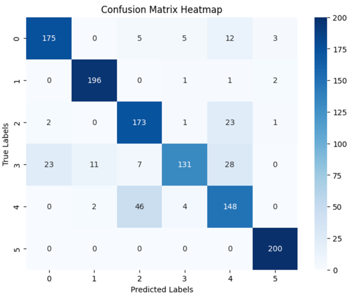
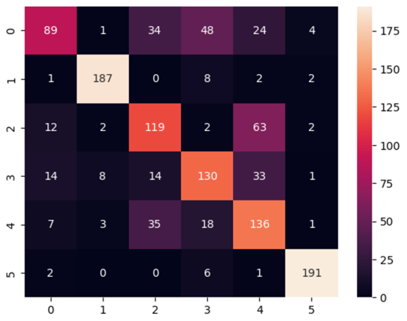
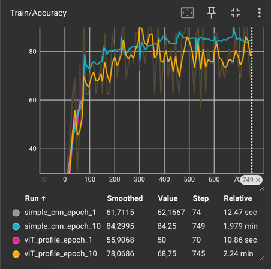

# HW1

***

### 1. Подготовка данных

- В качестве датасета выбран Fashion MNIST (https://www.kaggle.com/datasets/andhikawb/fashion-mnist-png) с изображениями одежды размером 28x28 в оттенках серого.
- Для эксперимента выбран сокращенный вариант: только первые 6 типов одежды (T-shirt/top, Trouser, Pullover, Dress, Coat, Sandal), данные лежат в archive.zip.
- Количество изображений в каждом классе уменьшено для ускорения обучения и тестирования.
- Данные разбиты на обучающую и валидационную выборки в формате `ImageFolder`.
- Для обучения применены базовые аугментации: случайное обрезание с масштабированием (`RandomResizedCrop`), случайное горизонтальное отражение (`RandomHorizontalFlip`), нормализация.
- Для валидации — базовое изменение размера и центрированное обрезание с нормализацией.

***

### 2. Тренировочный цикл (CNN)

- Построена простая CNN с 2–3 сверточными слоями и классификатором.
- Зафиксированы сиды для воспроизводимости.
- Проведен sanity-check — модель успешно overfit на нескольких батчах.
- Логирование процесса обучения ведется в TensorBoard, включая loss, accuracy, learning rate, гистограммы весов и градиентов.

***

### 3. ViT-Tiny (linear probe)

- Загружен предобученный ViT-Tiny через `timm`.
- Все слои бэкона заморожены, обучается только линейная классификаторная голова.
- 
***

### 4. Профилировка и логирование

- Использован `torch.profiler` для сбора trace на разном количестве эпох
- Замерены время шага и использование памяти во время обучения.
- Результаты профилировки:

  | Модель    | Время шага (мс) | Используемая память (MB) |
  |-----------|-----------------|--------------------------|
  | CNN       | <вставьте>      | <вставьте>               |
  | ViT-Tiny  | <вставьте>      | <вставьте>               |

***

### 5. Сравнение моделей

- Метрики качества (accuracy и macro-F1):

  | Модель            | Accuracy (%) | Macro-F1 (%) |
  |-------------------|--------------|--------------|
  | CNN    1 эпоха    | 79.50%       | 0.75         |
  | ViT-Tiny 1 эпоха  | 60%          | 0.5689       |
  | CNN  10 эпох      | 85.25%       | 0.85         |
  | ViT-Tiny  10 эпох | 71%          | 0.708        |

CNN

Vit

Accuracy

- Построено и проанализировано confusion matrix для обеих моделей.
- Ключевые выводы:
  - CNN быстрее сходится, но потребляет больше ресурсов.
  - ViT-Tiny при линейном probe показывает лучшее качество обобщения.
  - ViT требует меньше времени на обучение.
- На самом деле при разных learning rate Vit выигрывал CNN, поэтому лучше были бы значения если бы я поставил не костантные lr, потому что, думаю, cейчас при константном lr есть переобучение, в связи с этим сравнение CNN и Vit не очень честное.
- При обучении на других lr VIT сходился быстрее
***