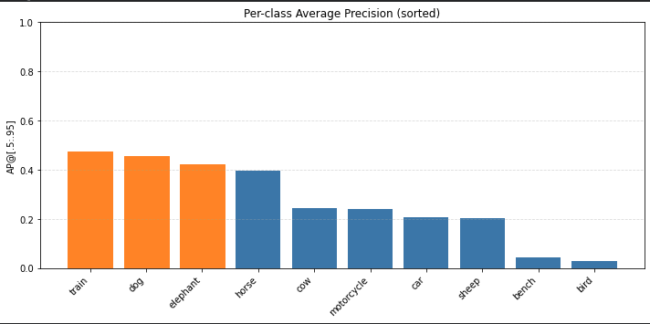

### Реализация
В рамках задания был реализован и обучен детектор объектов на основе трансформерной архитектуры DETR (`AutoModelForObjectDetection` с чекпоинтом `facebook/detr-resnet-50`) на подмножестве COCO из 10 классов: `cow`, `car`, `dog`, `motorcycle`, `bird`, `sheep`, `elephant`, `horse`, `train`, `bench`. 

Основные цели: 
- подготовка mini‑COCO из полного COCO (filter_dataset.py); 
- запуск fine‑tuning DETR на этом наборе; 
- логирование обучения в TensorBoard и сохранение чекпоинтов (ОЧЕНЬ ПОМОГЛО НА ОБУЧЕНИИ); 
- вычисление mAP/mAR и per‑class AP; 
- разбор ошибок классификации и локализации.
### Аугментации
Для train/val использовались аугментации на базе Albumentations:
- Train:
  - `LongestMaxSize(500)` + `PadIfNeeded(500, 500)` (чёрный паддинг);  
  - горизонтальный флип;  
  - цветовые аугментации (`RandomBrightnessContrast`, `HueSaturationValue`);  
  - лёгкие геометрические (`Rotate`, `RandomScale`);  
  - шум/размытие (`GaussianBlur`, `GaussNoise`).  
- Val:
  - только `LongestMaxSize(500)` + `PadIfNeeded(500, 500)` для детерминированного препроцессинга.  

Боксы в Albumentations обрабатываются в формате `pascal_voc`, с параметрами `min_area > 0` и `clip=True`, чтобы не оставлять вырожденные боксы.

## Результаты
Пример предсказания на валидационных данных:

## Метрики и результаты

### Глобальные метрики (TorchMetrics mAP)

Для оценки использовался `torchmetrics.detection.MeanAveragePrecision` с форматами боксов `xywh` и нормализованными координатами, которые денормализуются в пиксели относительно `orig_size`

**По всему валидационному набору:**
- `mAP@[.5:.95]` ≈ **0.27**  
- `mAP@0.5` ≈ **0.42**  
- `mAP@0.75` ≈ **0.29**  
- `mAR@100` ≈ **0.57**  
Таким образом:
- при мягком пороге IoU=0.5 модель находит и правильно классифицирует объекты в среднем в ~42 % случаев;  
- при более строгом IoU=0.75 качество падает, что указывает на неидеальную точность локализации (рамки часто стоят «примерно», а не точно по объекту);  
- recall при допустимых 100 детекциях на картинку достаточно высокий (около 0.57), то есть модель видит много объектов, но часть предсказаний либо лишние, либо с неверными классами.
### Per‑class AP

Крупные и контрастные объекты (поезд, собака, слон) детектируются легче; мелкие объекты (`bird`, `bench`) и классы с малым количеством примеров в mini‑COCO детектируются существенно хуже.